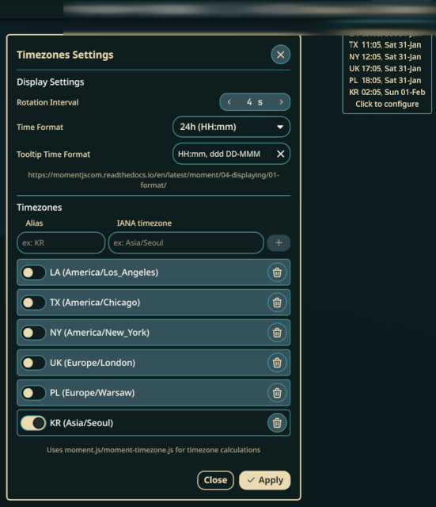

Originally forked from noctalia-plugins/world-clock by Lokize.
It's a playground for learning QML, etc, but also a place to implement changes the original author didn't want to do [my request](https://github.com/noctalia-dev/noctalia-plugins/discussions/54#discussioncomment-15434653). 

Most of the original plugin functionality is still there.

Changes:
- modified Tooltip to display all timezones 
- removed 5 zone limit 
- removed hardcoded zones in favor of user input (valid IANA zones)
- used moment.js & moment-timezone.js to calculate time/date
- settings:
    - added custom tooltip date/time format 
    - added separate Alias and Timezones fields 

To-do:
- allow editing existing timezones and aliases
- allow changing sort order of existing timezones
- don't hardcode bar widget date/time format
